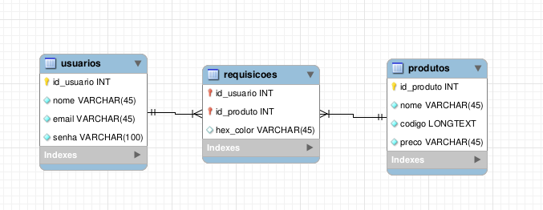
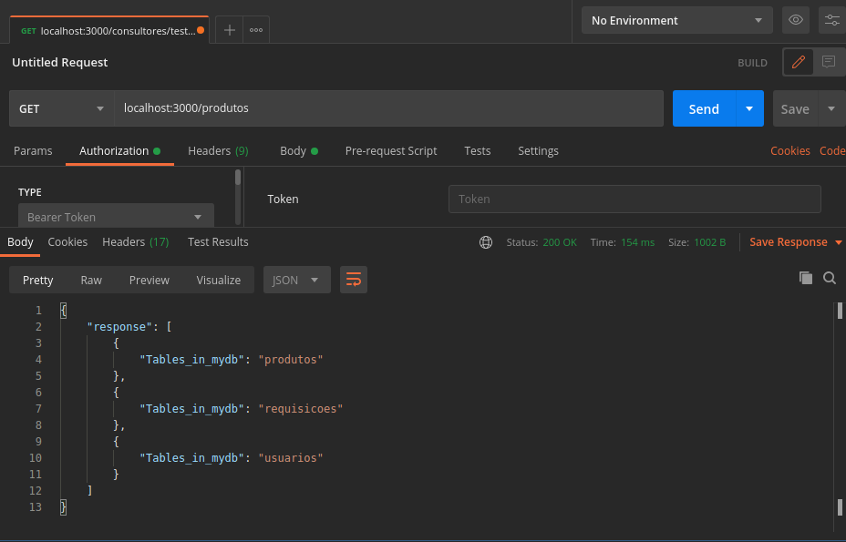
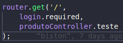
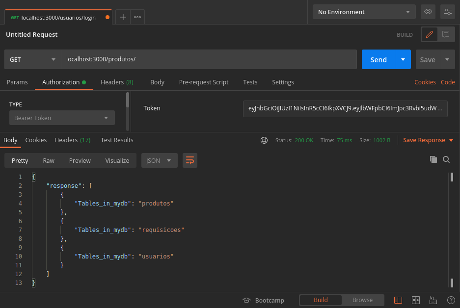

# Relatorios Projeto API    

Arquivo referente as atualizações do Projeto de API no Curso de BigData no Agronegócio
  - João V. Biston Nunes
  - Gabriel Santos
  - Adriano Rordriguez
  - Yuri borrasca
  - Paulo Okuda
  
#### Instalação:
Para criar um container com a imagem do banco mariadb:
```sh 
docker run -p 3306:3306 --name projeto-api -e MYSQL_ROOT_PASSWORD=root -d mariadb:10.1.43
```
Para instalar as dependencias do projeto e rodar:
```sh
npm install
npm start
```

#### Atualizações 27/10:
Após a ultima aula, foi definido pelo grupo a arquitetura do projeto que consiste nas seguintes tecnologias:
  - FrontEnd: Angular
  - API: NodeJS
  - Banco de Dados: MariaDB
 
Então no dia 27/10 começou-se a preparar o ambiente de desenvolvimento e foi criado o banco de dados segundo a modelagem abaixo, a estrutura do projeto de API conforme o [commit inicial](https://github.com/BistonN/projeto-api/commit/5f517bfd50e5d8a25ec05152cc633b6078d100ef) e a conexão do projeto como banco de dados.



Após isso foi realizado um teste criando uma rota de 'produtos' com um end-point 'teste' que executava uma query que apenas mostrasse as tabelas do banco de dados, afim de verificar se a conexão com o banco havia sido realizada



#### Atualizações 03/11:
Foi adicionado ao projeto o [commit 03/nov](https://github.com/BistonN/projeto-api/commit/aef8bbf36f65080af29869ed17ea1d2f0ca15d0c):
  - Controller de usuarios;
  - Rotas de usuarios com uma rota POST para o cadastro do usuario;
  - middleware de login, para futuramente ser usado para validar a autenticação do usuario;
  - controller utils com metodo de getErro para facilitar a debugação após o deploy na nuvem;

#### Atualizações 10/11:
Foi adicionado ao projeto o [commit 10/nov](https://github.com/BistonN/projeto-api/commit/641b97a7a7c50b5ce5abc4b5d957db55c4f8539f):
  - Finalizando todos os metodos do controller de usuario: login, cadastro e outros middleware para auxilio dos metodos;
  - Adicionado biblioteca para criptografia no login;
  - Teste do login.require ultilziando a authenticação por token, conforme a figura a seguir




#### Atualizações 17/11:
Foi adicionado ao projeto o [commit 17/nov](https://github.com/BistonN/projeto-api/commit/a470c9c2039c65243fc472141cab7f744b4369dc)
  -Criado as rotas de produtos;
  -Crido aplicativo para interação com a API;
  -Realização da comunicação da api com o APP;
  -Iniciação do fontend da aplicação;

